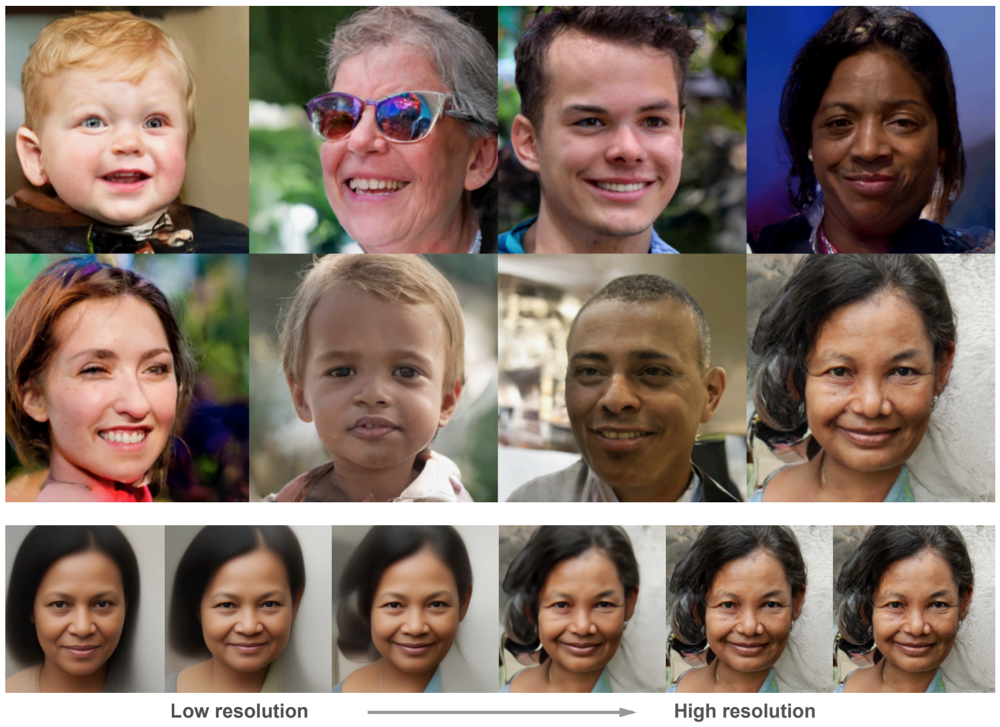

# Very Deep VAEs

Repository for the paper "Very Deep VAEs Generalize Autoregressive Models and Can Outperform Them on Images" (https://arxiv.org/abs/2011.10650)

Some model samples and a visualization of how it generates them:


This repository is tested with PyTorch 1.6, CUDA 10.1, Numpy 1.16, Ubuntu 18.04, and V100 GPUs.

# Setup
Several additional packages are required, including NVIDIA Apex:
```
pip install imageio
pip install mpi4py
pip install sklearn
git clone https://github.com/NVIDIA/apex
cd apex
pip install -v --no-cache-dir --global-option="--cpp_ext" --global-option="--cuda_ext" ./
cd ..
```

Also, you'll have to download the data, depending on which one you want to run:
```
./setup_cifar10.sh
./setup_imagenet.sh imagenet32
./setup_imagenet.sh imagenet64
./setup_ffhq256.sh
./setup_ffhq1024.sh  /path/to/images1024x1024  # this one depends on you first downloading the subfolder `images_1024x1024` from https://github.com/NVlabs/ffhq-dataset on your own
```

# Training models
Hyperparameters all reside in `hps.py`. We use 2 gpus for our CIFAR-10 runs, and 32 for the rest of the models. (Using a lower batch size is also possible and results in slower learning, and may also require a lower learning rate).

The `mpiexec` arguments you use for runs with more than 1 node depend on the configuration of your system, so please adapt accordingly.

```bash
mpiexec -n 2 python train.py --hps cifar10
mpiexec -n 32 python train.py --hps imagenet32
mpiexec -n 32 python train.py --hps imagenet64
mpiexec -n 32 python train.py --hps ffhq256
mpiexec -n 32 python train.py --hps ffhq1024
```

# Restoring saved models
For convenience, we have included training checkpoints which can be restored in order to confirm performance, continue training, or generate samples.

### ImageNet 32
```bash
# 119M parameter model, trained for 1.7M iters (about 2.5 weeks on 32 V100)
wget https://openaipublic.blob.core.windows.net/very-deep-vaes-assets/vdvae-assets/imagenet32-iter-1700000-log.jsonl
wget https://openaipublic.blob.core.windows.net/very-deep-vaes-assets/vdvae-assets/imagenet32-iter-1700000-model.th
wget https://openaipublic.blob.core.windows.net/very-deep-vaes-assets/vdvae-assets/imagenet32-iter-1700000-model-ema.th
wget https://openaipublic.blob.core.windows.net/very-deep-vaes-assets/vdvae-assets/imagenet32-iter-1700000-opt.th
python train.py --hps imagenet32 --restore_path imagenet32-iter-1700000-model.th --restore_ema_path imagenet32-iter-1700000-model-ema.th --restore_log_path imagenet32-iter-1700000-log.jsonl --restore_optimizer_path imagenet32-iter-1700000-opt.th --test_eval
# should give 2.6364 nats per dim, which is 3.80 bpd
```

### ImageNet 64
```bash
# 125M parameter model, trained for 1.6M iters (about 2.5 weeks on 32 V100)
wget https://openaipublic.blob.core.windows.net/very-deep-vaes-assets/vdvae-assets-2/imagenet64-iter-1600000-log.jsonl
wget https://openaipublic.blob.core.windows.net/very-deep-vaes-assets/vdvae-assets-2/imagenet64-iter-1600000-model.th
wget https://openaipublic.blob.core.windows.net/very-deep-vaes-assets/vdvae-assets-2/imagenet64-iter-1600000-model-ema.th
wget https://openaipublic.blob.core.windows.net/very-deep-vaes-assets/vdvae-assets-2/imagenet64-iter-1600000-opt.th
python train.py --hps imagenet64 --restore_path imagenet64-iter-1600000-model.th --restore_ema_path imagenet64-iter-1600000-model-ema.th --restore_log_path imagenet64-iter-1600000-log.jsonl --restore_optimizer_path imagenet64-iter-1600000-opt.th --test_eval
# should be 2.44 nats, or 3.52 bits per dim
```

### FFHQ-256
```bash
# 115M parameters, trained for 1.7M iterations (or about 2.5 weeks) on 32 V100
wget https://openaipublic.blob.core.windows.net/very-deep-vaes-assets/vdvae-assets/ffhq256-iter-1700000-log.jsonl
wget https://openaipublic.blob.core.windows.net/very-deep-vaes-assets/vdvae-assets/ffhq256-iter-1700000-model.th
wget https://openaipublic.blob.core.windows.net/very-deep-vaes-assets/vdvae-assets/ffhq256-iter-1700000-model-ema.th
wget https://openaipublic.blob.core.windows.net/very-deep-vaes-assets/vdvae-assets/ffhq256-iter-1700000-opt.th
python train.py --hps ffhq256 --restore_path ffhq256-iter-1700000-model.th --restore_ema_path ffhq256-iter-1700000-model-ema.th --restore_log_path ffhq256-iter-1700000-log.jsonl --restore_optimizer_path ffhq256-iter-1700000-opt.th --test_eval
# should be 0.4232 nats, or 0.61 bits per dim
```

### FFHQ-1024
```bash
# 115M parameters, trained for 1.7M iterations (or about 2.5 weeks) on 32 V100
wget https://openaipublic.blob.core.windows.net/very-deep-vaes-assets/vdvae-assets/ffhq1024-iter-1700000-log.jsonl
wget https://openaipublic.blob.core.windows.net/very-deep-vaes-assets/vdvae-assets/ffhq1024-iter-1700000-model.th
wget https://openaipublic.blob.core.windows.net/very-deep-vaes-assets/vdvae-assets/ffhq1024-iter-1700000-model-ema.th
wget https://openaipublic.blob.core.windows.net/very-deep-vaes-assets/vdvae-assets/ffhq1024-iter-1700000-opt.th
python train.py --hps ffhq1024 --restore_path ffhq1024-iter-1700000-model.th --restore_ema_path ffhq1024-iter-1700000-model-ema.th --restore_log_path ffhq1024-iter-1700000-log.jsonl --restore_optimizer_path ffhq1024-iter-1700000-opt.th --test_eval
# should be 1.678 nats, or 2.42 bits per dim
```

### CIFAR-10
```bash
# 39M parameters, trained for ~1M iterations with early stopping (a little less than a week on 2 GPUs)
wget https://openaipublic.blob.core.windows.net/very-deep-vaes-assets/vdvae-assets-2/cifar10-seed0-iter-900000-model-ema.th
wget https://openaipublic.blob.core.windows.net/very-deep-vaes-assets/vdvae-assets-2/cifar10-seed1-iter-1050000-model-ema.th
wget https://openaipublic.blob.core.windows.net/very-deep-vaes-assets/vdvae-assets-2/cifar10-seed2-iter-650000-model-ema.th
wget https://openaipublic.blob.core.windows.net/very-deep-vaes-assets/vdvae-assets-2/cifar10-seed3-iter-1050000-model-ema.th
python train.py --hps cifar10 --restore_ema_path cifar10-seed0-iter-900000-model-ema.th --test_eval
python train.py --hps cifar10 --restore_ema_path cifar10-seed1-iter-1050000-model-ema.th --test_eval
python train.py --hps cifar10 --restore_ema_path cifar10-seed2-iter-650000-model-ema.th --test_eval
python train.py --hps cifar10 --restore_ema_path cifar10-seed3-iter-1050000-model-ema.th --test_eval
# seeds 0, 1, 2, 3 should give 2.879, 2.842, 2.898, 2.864 bits per dim, for an average of 2.87 bits per dim.
```
